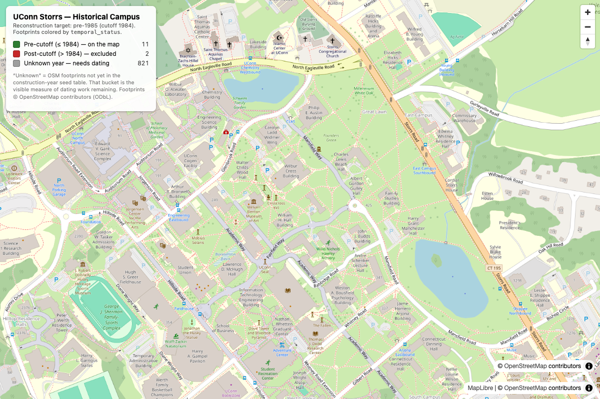

# Historical UConn Storrs Campus Map — early-1980s reconstruction

A temporal-GIS reconstruction of the UConn Storrs campus as it existed in the
early 1980s. The approach: take **modern** OpenStreetMap building footprints and
classify each by construction year against a cutoff, using a committed
construction-date table as the source of truth. Buildings built after the cutoff
are flagged out; buildings with no known date go into an explicit `unknown`
bucket — the visible measure of how much dating work remains.

This repo is the **foundation**: a working end-to-end skeleton
(data pipeline → API → web map), not a finished historical map.



## What it does

```
pipeline/  fetch OSM footprints (cached) → enrich with seed years → classify → GeoJSON
api/       FastAPI serving the GeoJSON + /api/config + a stubbed tile route
web/       Vite + React + MapLibre map, footprints colored by temporal_status
```

Each footprint carries a **`temporal_status`**:

| status        | meaning                                   | color |
| ------------- | ----------------------------------------- | ----- |
| `pre_cutoff`  | construction year ≤ cutoff — on the map   | green |
| `post_cutoff` | construction year > cutoff — excluded     | red   |
| `unknown`     | no known year — needs dating              | gray  |

Default cutoff is **1984** (`pipeline/config.py`). Current output: 11 pre / 2
post / 821 unknown out of 834 OSM footprints.

## Run it

Prereqs: Python 3.11+ (3.13 used here — see DECISIONS.md), Node 18+ (npm).

```bash
make setup     # venv + pip install -r requirements.txt + npm install (web)
make data      # run the pipeline -> data/processed/buildings.geojson
make api       # terminal 1: FastAPI on http://localhost:8000
make web       # terminal 2: Vite/React/MapLibre on http://localhost:5173
```

`api` and `web` are long-running servers — run them in two terminals. Then open
<http://localhost:5173>. `make all` runs setup + data and prints the next steps.

```bash
make test      # pytest — the temporal-filter spine
make clean      # remove venv, node_modules, generated data (keeps seed CSV)
```

> **Note on `node`/`npm`:** if `npm` isn't on your PATH, the Makefile falls back
> to the newest nvm-installed npm. The web install uses `web/.npmrc` to pin the
> **public** npm registry (see DECISIONS.md for why).

## The critical path — the construction-year table

**`data/seed/buildings_construction_years.csv` is the heart of this project.**
Everything else is plumbing; the accuracy of the historical map is exactly the
accuracy and completeness of this table.

- It currently holds **16 anchor buildings**, each with a `source` and a
  `year_confidence` (`high` / `medium` / `low`). No years are invented.
- Columns: `building_name, aliases, building_code, construction_year,
  year_confidence, source, notes`. `aliases` is `;`-delimited; the pipeline
  matches OSM names on **name or alias**, then a token-subset fallback (see
  DECISIONS.md), and stamps each feature with `match_method` so the join is
  auditable.
- **Honesty notes** baked into the data: `Beach Hall` (1930) and `NextGen`
  (2016) are inferred completion years (`medium`); `Veterans House` (c.1757) is
  `low` — fine for "definitely pre-cutoff," not for precision. `Babbidge` is
  sometimes cited as 1974 vs 1978 (both safely pre-cutoff).

### TODO — this table is the real work

Storrs has 150+ buildings; this is 16. Every OSM footprint not named here lands
in `unknown` (821 of them right now) — **that is correct behavior**, not a bug.
The realistic path to filling it:

- **UConn Archives & Special Collections** building files (per-building dates).
- The **NRHP historic-district nomination**, which documents the 1906–1942
  masonry core in detail.

Neither OSM nor any single web page has a complete dated inventory.

## Data sources & licensing

- **Building footprints:** OpenStreetMap, © OpenStreetMap contributors, **ODbL**
  — attributed in the map UI.
- **Basemap:** plain OSM raster tiles (placeholder). A USGS historical
  topographic basemap (public domain) is **stubbed** in `pipeline/fetch_usgs.py`
  for a future session.
- No copyrighted UConn/MAGIC map assets are embedded.

## Stubbed this session (interfaces + TODOs, not implemented)

- `pipeline/fetch_usgs.py` — USGS TNMAccess / Historical Topographic Map
  Collection basemap.
- `GET /tiles/{z}/{x}/{y}.png` — XYZ tile route, returns 404 + TODO for now.

See **DECISIONS.md** for every non-obvious choice (CRS, osmnx version pin, the
join strategy, the bbox-vs-view decision, etc.).
